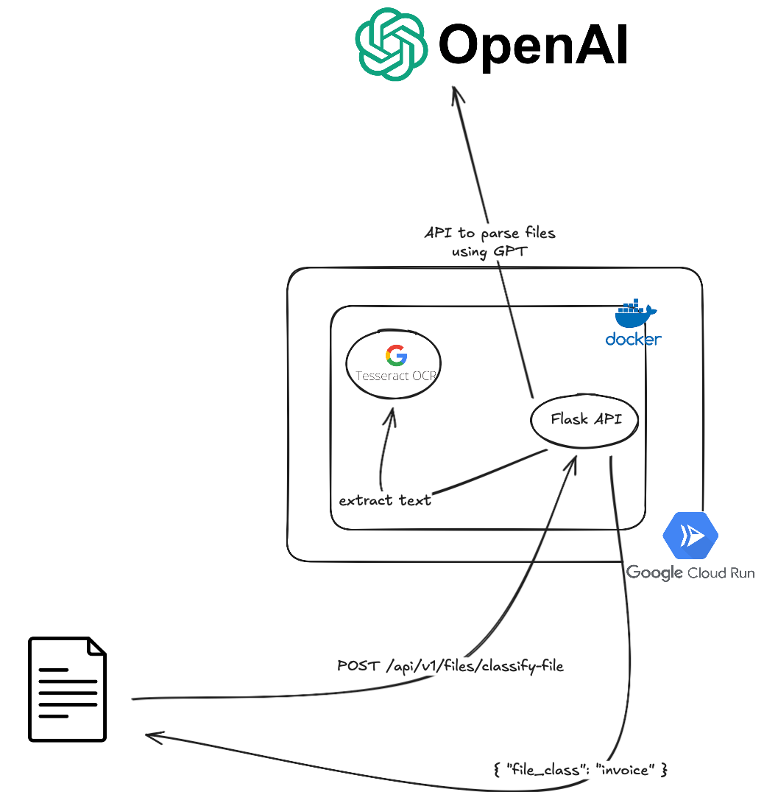

# Heron Coding Challenge - File Classifier

### Emil's take on the challenge
> Note: This is one of the few times I've written Python code, so please forgive me if the code is not up to standard. I've tried my best. Same goes for the GitHub Actions workflow.


The challenge is to improve the classifier by adding features and optimisations to handle (1) poorly named files, (2) scaling to new industries, and (3) processing larger volumes of documents. In order to handle the first two points, I've removed the existing classifier and replaced it with the following two components:
1. A text extraction using Google open-source Tesseract OCR.  
2. OpenAI's `gpt-3.5-turbo` model, which has been propmted to classify the document based on the extracted text. The GPT has been prompted using the extracted text from the files in the `files/` directory.

I've added a Dockerfile and a GitHub Actions workflow to build and deploy the classifier to Google Cloud Run.

A diagram of the system is shown below:




## How to access the classifier

The classifier is deployed to Google Cloud Run and can be accessed at https://join-the-siege-847542637991.europe-west2.run.app.

> Note: The first time you access the endpoint, it may take a few seconds to warm up as the Google Cloud Run scales to 0 instances.

The two available endpoints are:

- `GET /api/v1/files/`
    - Returns a welcome message.

- `POST /api/v1/files/classify-file`
    - Classifies a file based on its content.

Example usage:
```
$ curl -XGET https://join-the-siege-847542637991.europe-west2.run.app/api/v1/files/
{"message":"Welcome to the files API!"}
$ curl -XPOST -F 'file=@./files/drivers_license_3.jpg' https://join-the-siege-847542637991.europe-west2.run.app/api/v1/files/classify-file
{"file_type":"drivers-license"}
```

## Overview

At Heron, we’re using AI to automate document processing workflows in financial services and beyond. Each day, we handle over 100,000 documents that need to be quickly identified and categorised before we can kick off the automations.

This repository provides a basic endpoint for classifying files by their filenames. However, the current classifier has limitations when it comes to handling poorly named files, processing larger volumes, and adapting to new industries effectively.

**Your task**: improve this classifier by adding features and optimisations to handle (1) poorly named files, (2) scaling to new industries, and (3) processing larger volumes of documents.

This is a real-world challenge that allows you to demonstrate your approach to building innovative and scalable AI solutions. We’re excited to see what you come up with! Feel free to take it in any direction you like, but we suggest:


### Part 1: Enhancing the Classifier

- What are the limitations in the current classifier that's stopping it from scaling?
- How might you extend the classifier with additional technologies, capabilities, or features?


### Part 2: Productionising the Classifier 

- How can you ensure the classifier is robust and reliable in a production environment?
- How can you deploy the classifier to make it accessible to other services and users?

We encourage you to be creative! Feel free to use any libraries, tools, services, models or frameworks of your choice

### Possible Ideas / Suggestions
- Train a classifier to categorize files based on the text content of a file
- Generate synthetic data to train the classifier on documents from different industries
- Detect file type and handle other file formats (e.g., Word, Excel)
- Set up a CI/CD pipeline for automatic testing and deployment
- Refactor the codebase to make it more maintainable and scalable

## Marking Criteria
- **Functionality**: Does the classifier work as expected?
- **Scalability**: Can the classifier scale to new industries and higher volumes?
- **Maintainability**: Is the codebase well-structured and easy to maintain?
- **Creativity**: Are there any innovative or creative solutions to the problem?
- **Testing**: Are there tests to validate the service's functionality?
- **Deployment**: Is the classifier ready for deployment in a production environment?


## Getting Started
1. Clone the repository:
    ```shell
    git clone <repository_url>
    cd heron_classifier
    ```

2. Install dependencies:
    ```shell
    python -m venv venv
    source venv/bin/activate
    pip install -r requirements.txt
    ```

3. Run the Flask app:
    ```shell
    python -m src.app
    ```

4. Test the classifier using a tool like curl:
    ```shell
    curl -X POST -F 'file=@path_to_pdf.pdf' http://127.0.0.1:5000/classify_file
    ```

5. Run tests:
   ```shell
    pytest
    ```

## Submission

Please aim to spend 3 hours on this challenge.

Once completed, submit your solution by sharing a link to your forked repository. Please also provide a brief write-up of your ideas, approach, and any instructions needed to run your solution. 
